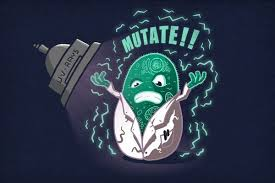

+++
## What is Mutating State?

 OOP
 React and JS typically functional programming
+++

### Why do we not want to do this?
- React is immutable
- if we mutate, we are not using pure functions
+++

### What are Pure functions?

+++

### Questions / Feedback ?
